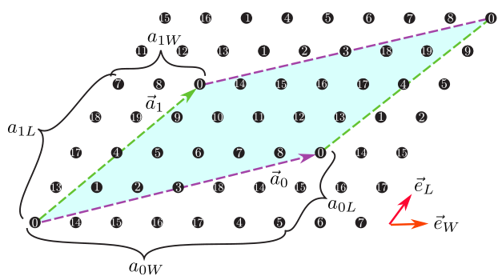

.. include:: ../bib/ref.txt

.. _HowToStandard:
             
スタンダードモード用入力ファイル書式
====================================

スタンダードモード用入力ファイルは次のような格好をしています。

::

    W = 2
    L = 4
    model = "spin"

    lattice = "triangular lattice"
    //mu = 1.0
    // t = -1.0
    // t' = -0.5
    // U = 8.0
    //V = 4.0
    //V'=2.0
    J = -1.0
    J'=-0.5
    // nelec = 8

大まかなルールは次のとおりです。

-  各行にはひと組ずつキーワード(``=`` の前)と
   パラメーター(``=`` の後)が書かれており間は ``=`` で区切られています。

-  各キーワードは順不同に記述できます。

-  空白行、または ``//`` で始まる行(コメントアウト)は読み飛ばされます。

-  各キーワード、パラメーターの大文字 :math:`\cdot` 小文字は区別されません。
   ダブルクオート、空白は無視されます。

-  必ず指定しなければいけないパラメーター、
   指定しない場合デフォルト値が使われるパラメーター、
   (他のパラメーターの組み合わせによっては)使われないパラメーターが存在します。
   使われないパラメーターが指定された場合にはプログラムは終了し、
   入力ファイルをチェックするようにというメッセージが英語で表示されます。

次に各キーワードの説明をします。

計算の種類に関する必須パラメーター
~~~~~~~~~~~~~~~~~~~~~~~~~~~~~~~~~~

-  ``model``

   **形式 :** 文字列( ``"Fermion Hubbard"``, ``"Spin"``,
   ``"Kondo Lattice"`` , ``"Fermion HubbardGC"``, ``"SpinGC"``,
   ``"Kondo LatticeGC"`` のいずれか)

   **説明 :** 計算対象の模型を指定します。
   文字列 ``"Fermion Hubbard"`` は、カノニカル集団のフェルミ粒子Hubbard模型

   .. math::
      :label: hubbard

      \begin{aligned}
      H = - \mu \sum_{i \sigma} c^\dagger_{i \sigma} c_{i \sigma} 
      - \sum_{i \neq j \sigma} t_{i j} c^\dagger_{i \sigma} c_{j \sigma} 
      + \sum_{i} U n_{i \uparrow} n_{i \downarrow}
      + \sum_{i \neq j} V_{i j} n_{i} n_{j},
      \end{aligned}

   文字列 ``"Spin"`` はカノニカル集団のスピン模型
   ( :math:`\sigma_1, \sigma_2=x, y, z` )

   .. math::
      :label: spin

      \begin{aligned}
      H &= -h \sum_{i} S_{i z} - \Gamma \sum_{i} S_{i x} + D \sum_{i} S_{i z} S_{i z}
      \nonumber \\
      &+ \sum_{i j, \sigma_1}J_{i j \sigma_1} S_{i \sigma_1} S_{j \sigma_1}+ \sum_{i j, \sigma_1 \neq \sigma_2} J_{i j \sigma_1 \sigma_2} S_{i \sigma_1} S_{j \sigma_2} ,
      \end{aligned}

   文字列 ``"Kondo Lattice"`` はカノニカル集団の近藤格子模型
   (Hubbard模型と同様に :math:`U` と :math:`J` を入れることも可能)

   .. math::
      :label: kondo
      
      \begin{aligned}
      H &= - \mu \sum_{i \sigma} c^\dagger_{i \sigma} c_{i \sigma} 
      - t \sum_{\langle i j \rangle \sigma} c^\dagger_{i \sigma} c_{j \sigma} 
      + \frac{J}{2} \sum_{i} \left\{
      S_{i}^{+} c_{i \downarrow}^\dagger c_{i \uparrow}
      + S_{i}^{-} c_{i \uparrow}^\dagger c_{i \downarrow}
      + S_{i z} (n_{i \uparrow} - n_{i \downarrow})\right\}
      \nonumber \\
      & +  \sum_{i} U n_{i \uparrow} n_{i \downarrow}
      + \sum_{i \neq j} V_{i j} n_{i} n_{j}
      ,
      \end{aligned}

   に対応します。 また、
   ``"Fermion HubbardGC"`` 、 ``"SpinGC"`` 、 ``"Kondo LatticeGC"`` はそれぞれ
   :math:`S_z` 非保存でのフェルミ粒子Hubbard模型[式 :eq:`hubbard` ]、
   スピン模型[式 :eq:`spin` ]、
   近藤格子模型[式 :eq:`kondo` ]に対応します。
   :math:`{\mathcal H}\Phi` との互換性からGC(=グランドカノニカル)と付いていますが、
   粒子数は保存していますのでご注意ください。

-  ``lattice``

   **形式 :** 文字列( ``"Chain Lattice"``, ``"Square Lattice"``,
   ``"Triangular Lattice"``, ``"Honeycomb Lattice"``, ``"Kagome"``,
   ``"Ladder"`` のいずれか)

   **説明 :** 格子の形状を指定します。 上記文字列はそれぞれ1次元鎖(Fig.
   [ :num:`latticepng` ](a))、 2次元正方格子(Fig.
   [ :num:`latticepng` ](b))、 2次元三角格子(Fig.
   [ :num:`latticepng` ](c))、 2次元異方的蜂の巣格子(Fig.
   [ :num:`honeycombpng` ])、 カゴメ格子(Fig. [ :num:`kagomepng` ])、
   梯子格子(Fig. [ :num:`ladderpng` ])に対応します。

   .. _latticepng:
   
   .. figure:: ../figs/chap04_1_lattice.png
      :width: 15.00000cm

      (a)1次元鎖、(b)2次元正方格子、(c)2次元三角格子の模式図.
      ホッピング積分、オフサイトクーロン積分、スピン結合は、
      再近接サイト間(マゼンタの実線)ではそれぞれ :math:`t,V,J` となり、
      次近接サイト間(緑の破線)ではそれぞれ :math:`t',V',J'` となります。

   .. _honeycombpng:

   .. figure:: ../figs/chap04_1_honeycomb.png
      :width: 15.00000cm

      2次元異方的蜂の巣格子の模式図.
      ホッピング積分、オフサイトクーロン積分、スピン結合は、
      ボンドの方向によって異なります。

   .. _kagomepng:

   .. figure:: ../figs/kagome.png
      :width: 15.00000cm

      カゴメ格子の模式図. 

   .. _ladderpng:

   .. figure:: ../figs/ladder.png
      :width: 10.00000cm

      梯子格子の模式図.

格子に関するパラメーター
~~~~~~~~~~~~~~~~~~~~~~~~

1次元鎖
^^^^^^^

Fig. [ :num:`latticepng` ](a)

-  ``L``

   **形式 :** 自然数

   **説明 :** 鎖の長さを指定します.

梯子格子
^^^^^^^^

Fig. [ :num:`ladderpng` ]

-  ``L``

   **形式 :** 自然数

   **説明 :** 梯子の長さを指定します.

-  ``W``

   **形式 :** 自然数

   **説明 :** 梯子の本数を指定します.

.. _unitlatticepng:

   三角格子において、 :math:`{\vec a}_0 = (6, 2), {\vec a}_1 = (2, 4)` とした場合のセル形状。
   :math:`{\vec a}_0` (マゼンタ)および :math:`{\vec a}_1` (グリーン)
   で囲まれた部分(サイト数は20)が計算するセルとなる。 

正方格子、 三角格子、 蜂の巣格子、 カゴメ格子
^^^^^^^^^^^^^^^^^^^^^^^^^^^^^^^^^^^^^^^^^^^^^

正方格子[Fig. [ :num:`latticepng` ](b)]、 三角格子[Fig. [ :num:`latticepng` ](c)]、 蜂の巣格子(Fig. [ :num:`honeycombpng` ])、 カゴメ格子(Fig. [ :num:`kagomepng` ])

これらの格子では、標準の単位胞(図中の黒の破線を参照)を用いて格子形状を指定する方法と、
それらとは別の方向に格子ベクトルを取る方法が選択できます。
また、両方を指定した場合にはプログラムを終了します。

-  ``W``, ``L``

   **形式 :** 自然数

   **説明 :** 標準の単位胞の並び方を指定します。

-  ``a0W``, ``a0L``, ``a1W``, ``a1L``

   **形式 :** 自然数

   **説明 :**
   格子を指定する2本のベクトル( :math:`{\vec a}_0, {\vec a}_1`)
   を指定します (Fig. [ :num:`unitlatticepng` ])。
   これらのベクトルは標準の並進ベクトルを基底とした座標(Fractional
   coordinate) で指定されます。

スタンダードモードで出力される ``lattice.gp`` (1次元鎖、梯子格子では出力されません)
というファイルを使うと、
自分の意図した通りの格子のとり方になっているかどうかを確かめる事が出来ます。
このファイルは、次のようにして ``gnuplot`` に読み込ませることが出来ます。

::

    $ gnuplot lattice.gp

副格子
~~~~~~

以下パラメータを用いると変分波動関数のペア軌道部分に副格子の周期性を持たせることが出来ます。

-  ``a0Wsub``, ``a0Lsub``, ``a1Wsub``, ``a1Lsub``, ``Wsub``, ``Lsub``

   **形式 :** 自然数。デフォルトでは ``a0Wsub=a0W``, ``a0Lsub=a0L``,
   ``a1Wsub=a1W``, ``a1Lsub=a1L``, ``Wsub=W``, ``Lsub=L`` となる。
   すなわち副格子を用いず、変分波動関数のすべてのパラメーターが独立に変化する。

   **説明 :** これらのパラメーターの指定の仕方は ``a0W``, ``a0L``,
   ``a1W``, ``a1L``, ``W``, ``L`` と同様です。
   ただし、元の計算セルが副格子に整合しない場合にはプログラムを終了します。

ハミルトニアンの各項の係数
~~~~~~~~~~~~~~~~~~~~~~~~~~

デフォルト値は特に記載されていないものについては0に設定してあります。
型が複素数のパラメータは「実部, 虚部」(間に“,”)の形式で指定し、
実数の場合には「実部」で指定が可能です。

局所項
^^^^^^

-  ``mu``

   **形式 :** 実数

   **説明 :**
   Hubbardおよび近藤格子模型での化学ポテンシャルを指定します。

-  ``U``

   **形式 :** 実数

   **説明 :**
   Hubbardおよび近藤格子模型でのオンサイトクーロン積分を指定します。

-  ``Jx``, ``Jy``, ``Jz``, ``Jxy``, ``Jyx``, ``Jxz``, ``Jzx``, ``Jyz``,
   ``Jzy``

   **形式 :** 実数

   **説明 :**
   近藤格子模型での、局在電子と遍歴電子のスピン結合を指定します。
   また対角項について,
   ``Jx, Jy, Jz`` を指定する代わりに、パラメータ ``J`` を指定すると
   ``Jx = Jy = Jz = J`` が代入されます。 ``J`` を指定した上で ``Jx``,
   ``Jy``, ``Jz`` を指定した場合はプログラムを終了します。

-  ``h``, ``Gamma``, ``D``

   **形式 :** 実数

   **説明 :**
   スピン模型での縦磁場、横磁場、異方性パラメータを指定します。

下記の非局所項は、梯子格子の場合とそれ以外(１次元鎖、矩形格子、三角格子、蜂の巣格子、カゴメ格子)
の場合で指定の仕方が異なります。
また、各格子で指定可能なパラメーターをTable
[table\_interactions]に表します。

================================== ======= ======== ======== ========== ========== ======== 
相互作用                           1次元鎖 矩形格子 三角格子 蜂の巣格子 カゴメ格子 梯子格子
================================== ======= ======== ======== ========== ========== ======== 
``J``, ``t``, ``V`` (省略形)       OK      OK       OK       OK         OK         NG
``J0``, ``t0``, ``V0``             OK      OK       OK       OK         OK         OK
``J1``, ``t1``, ``V1``             NG      OK       OK       OK         OK         OK
``J2``, ``t2``, ``V2``             NG      NG       OK       OK         OK         OK
``J'``, ``t'``, ``V'`` (省略形)    OK      OK       OK       OK         OK         NG
``J0'``, ``t0'``, ``V0'``          OK      OK       OK       OK         OK         NG
``J1'``, ``t1'``, ``V1'``          NG      OK       OK       OK         OK         OK
``J2'``, ``t2'``, ``V2'``          NG      NG       OK       OK         OK         OK
``J''``, ``t''``, ``V''`` (省略形) OK      OK       OK       OK         NG         NG
``J0''``, ``t0''``, ``V0''``       OK      OK       OK       OK         NG         NG
``J1''``, ``t1''``, ``V1''``       NG      OK       OK       OK         NG         NG
``J2''``, ``t2''``, ``V2''``       NG      NG       OK       OK         NG         NG
================================== ======= ======== ======== ========== ========== ======== 

Table: 各格子で定義可能な相互作用一覧。ただし、スピン結合については行列として与えることが可能。

非局所項[梯子格子]
^^^^^^^^^^^^^^^^^^

Fig. [ :num:`ladderpng` ]

-  ``t0``, ``t1``, ``t1'``, ``t2``, ``t2'``

   **形式 :** 複素数

   **説明 :** 梯子格子でのホッピング(Fig.
   [ :num:`ladderpng` ]参照)を指定します。

-  ``V0``, ``V1``, ``V1'``, ``V2``, ``V2'``

   **形式 :** 実数

   **説明 :** 梯子格子でのオフサイトクーロン積分 (Fig.
   [ :num:`ladderpng` ]参照)を指定します。

-  ``J0x``, ``J0y``, ``J0z``, ``J0xy``, ``J0yx``, ``J0xz``, ``J0zx``,
   ``J0yz``, ``J0zy``

-  ``J1x``, ``J1y``, ``J1z``, ``J1xy``, ``J1yx``, ``J1xz``, ``J1zx``,
   ``J1yz``, ``J1zy``

-  ``J1'x``, ``J1'y``, ``J1'z``, ``J1'xy``, ``J1'yx``, ``J1'xz``,
   ``J1'zx``, ``J1'yz``, ``J1'zy``

-  ``J2x``, ``J2y``, ``J2z``, ``J2xy``, ``J2yx``, ``J2xz``, ``J2zx``,
   ``J2yz``, ``J2zy``

-  ``J2'x``, ``J2'y``, ``J2'z``, ``J2'xy``, ``J2'yx``, ``J2'xz``,
   ``J2'zx``, ``J2'yz``, ``J2'zy``

   **形式 :** 実数

   **説明 :** 梯子格子でのスピン相互作用 (Fig.
   [ :num:`ladderpng` ]参照)を指定します。
   また対角項について、例えば ``J0x, J0y, J0z`` を指定する代わりに
   パラメータ ``J0`` を指定すると
   ``J0x = J0y = J0z = J0`` が代入されます。
   ``J0`` を指定した上で ``J0x, J0y, J0z`` 等も指定した場合はプログラムを終了します。
   ``J1``, ``J1'``, ``J2``, ``J2'`` についても同様です。

非局所項 (梯子格子以外)
^^^^^^^^^^^^^^^^^^^^^^^

Figs. [ :num:`latticepng` ], [ :num:`honeycombpng` ], [ :num:`kagomepng` ])]

-  ``t``, ``t0``, ``t1``, ``t2``

   **形式 :** 複素数

   **説明 :**
   Hubbardおよび近藤格子模型での、最近接サイト間の各方向のホッピングを指定します。
   また、ホッピングのボンド方向依存性がない場合は\ ``t0``, ``t1``,
   ``t2``\ を
   別々に指定する代わりにパラメータ\ ``t``\ を指定すると、\ ``t0 = t1 = t2 = t``\ が代入されます。
   ``t`` と ``t0`` 等の両方が指定された場合にはプログラムを終了します。

-  ``t'``, ``t0'``, ``t1'``, ``t2'``

   **形式 :** 複素数

   **説明 :**
   Hubbardおよび近藤格子模型での、次近接サイト間の各方向のホッピングを指定します。
   また、ホッピングのボンド方向依存性がない場合は\ ``t0'``, ``t1'``,
   ``t2'``\ を
   別々に指定する代わりにパラメータ\ ``t'``\ を指定すると、\ ``t0' = t1' = t2' = t'``\ が代入されます。
   ``t'``\ と\ ``t0'``\ 等の両方が指定された場合にはプログラムを終了します。

-  ``t''``, ``t0''``, ``t1''``, ``t2''``

   **形式 :** 複素数

   **説明 :**
   Hubbardおよび近藤格子模型での、第三近接サイト間の各方向のホッピングを指定します。
   また、ホッピングのボンド方向依存性がない場合は\ ``t0''``, ``t1''``,
   ``t2''``\ を
   別々に指定する代わりにパラメータ\ ``t''``\ を指定すると、\ ``t0'' = t1'' = t2'' = t''``\ が代入されます。
   ``t''``\ と\ ``t0''``\ 等の両方が指定された場合にはプログラムを終了します。

-  ``V``, ``V0``, ``V1``, ``V2``

   **形式 :** 実数

   **説明 :**
   Hubbardおよび近藤格子模型での、最近接サイト間のCoulomb積分を指定します。
   また、サイト間Coulomb積分のボンド方向依存性がない場合は\ ``V0``,
   ``V1``, ``V2``\ を
   別々に指定する代わりにパラメータ\ ``V``\ を指定すると、\ ``V0 = V1 = V2 = V``\ が代入されます。
   ``V``\ と\ ``V0``\ 等の両方が指定された場合にはプログラムを終了します。

-  ``V'``, ``V0'``, ``V1'``, ``V2'``

   **形式 :** 実数

   **説明 :**
   Hubbardおよび近藤格子模型での、次近接サイト間のCoulomb積分を指定します。
   また、サイト間Coulomb積分のボンド方向依存性がない場合は\ ``V0'``,
   ``V1'``, ``V2'``\ を
   別々に指定する代わりにパラメータ\ ``V'``\ を指定すると、\ ``V0' = V1' = V2' = V'``\ が代入されます。
   ``V'``\ と\ ``V0'``\ 等の両方が指定された場合にはプログラムを終了します。

-  ``V''``, ``V0''``, ``V1''``, ``V2''``

   **形式 :** 実数

   **説明 :**
   Hubbardおよび近藤格子模型での、第三近接サイト間のCoulomb積分を指定します。
   また、サイト間Coulomb積分のボンド方向依存性がない場合は\ ``V0''``,
   ``V1''``, ``V2''``\ を
   別々に指定する代わりにパラメータ\ ``V''``\ を指定すると、\ ``V0'' = V1'' = V2'' = V''``\ が代入されます。
   ``V''``\ と\ ``V0''``\ 等の両方が指定された場合にはプログラムを終了します。

-  ``J0x``, ``J0y``, ``J0z``, ``J0xy``, ``J0yx``, ``J0xz``, ``J0zx``,
   ``J0yz``, ``J0zy``
-  ``J1x``, ``J1y``, ``J1z``, ``J1xy``, ``J1yx``, ``J1xz``, ``J1zx``,
   ``J1yz``, ``J1zy``
-  ``J2x``, ``J2y``, ``J2z``, ``J2xy``, ``J2yx``, ``J2xz``, ``J2zx``,
   ``J2yz``, ``J2zy``

   **形式 :** 実数

   **説明 :**
   スピン模型での、最近接サイト間のスピン相互作用を指定します。
   また対角項について、例えば ``J0x, J0y, J0z`` を指定する代わりに
   パラメータ ``J0`` を指定すると
   ``J0x = J0y = J0z = J0`` が代入されます。
   ``J0`` を指定した上で ``J0x, J0y, J0z`` 等も指定した場合はプログラムを終了します。
   ``J1``, ``J2`` についても同様です。

   最近接スピン間相互作用のボンド方向依存性がない場合には、 ``Jx``,
   ``Jy``, ``Jz``, ``Jxy``, ``Jyx``, ``Jxz``, ``Jzx``, ``Jyz``, ``Jzy``
   を指定すると、 ``J0x = J1x = J2x = Jx`` のようにすべてのボンド方向のスピン間相互作用に
   同じ値を代入することが出来ます。
   ``Jx`` :math:`\sim` ``Jzy`` 系列のどれかと ``J0x`` :math:`\sim` ``J2zy`` 系列のどれかを両方指定した
   場合にはプログラムを終了します。
   以下に最近接間スピン相互作用の指定方法の例を挙げます。

   -  ボンド方向依存性、スピン方向依存性、相互作用の非対角成分( :math:`J_{x y}` 等)がない場合

      ``J`` を指定

   -  ボンド方向依存性、相互作用の非対角成分がなく、スピン方向依存性がある場合

      ``Jx, Jy, Jz`` のうち ``0`` でないものを指定

   -  ボンド方向依存性がなく、スピン方向依存性、相互作用の非対角成分がある場合

      ``Jx, Jy, Jz, Jxy, Jyz, Jxz, Jyx, Jzy, Jzx`` のうち ``0`` でないものを指定

   -  スピン方向依存性、相互作用の非対角成分がなく、ボンド方向依存性がある場合

      ``J0, J1, J2`` のうち ``0`` でないものを指定

   -  スピン方向依存性がなく、ボンド方向依存性、相互作用の非対角成分がある場合

      ``J0x, J0y, J0z, J1x, J1y, J1z, J2x, J2y, J2z`` のうち ``0`` でないものを指定

   -  ボンド方向依存性、スピン方向依存性、相互作用の非対角成分がある場合

      ``J0x`` :math:`\sim` ``J2zy`` のすべてのうち ``0`` でないものを指定

-  ``J'x``, ``J'y``, ``J'z``, ``J'xy``, ``J'yx``, ``J'xz``, ``J'zx``,
   ``J'yz``, ``J'zy``
-  ``J0'x``, ``J0'y``, ``J0'z``, ``J0'xy``, ``J0'yx``, ``J0'xz``, ``J0'zx``,
   ``J0'yz``, ``J0'zy``
-  ``J1'x``, ``J1'y``, ``J1'z``, ``J1'xy``, ``J1'yx``, ``J1'xz``, ``J1'zx``,
   ``J1'yz``, ``J1'zy``
-  ``J2'x``, ``J2'y``, ``J2'z``, ``J2'xy``, ``J2'yx``, ``J2'xz``, ``J2'zx``,
   ``J2'yz``, ``J2'zy``

   **形式 :** 実数

   **説明 :**
   スピン模型での、次近接サイト間のスピン相互作用を指定します。
   対角項について、 ``J'x, J'y, J'z`` を指定する代わりに
   パラメータ ``J'`` を指定すると
   ``J'x = J'y = J'z = J'`` が代入されます。
   ``J'`` を指定した上で ``J'x, J'y, J'z`` も指定した場合はプログラムを終了します。

-  ``J''x``, ``J''y``, ``J''z``, ``J''xy``, ``J''yx``, ``J''xz``, ``J''zx``,
   ``J''yz``, ``J''zy``
-  ``J0''x``, ``J0''y``, ``J0''z``, ``J0''xy``, ``J0''yx``, ``J0''xz``, ``J0''zx``,
   ``J0''yz``, ``J0''zy``
-  ``J1''x``, ``J1''y``, ``J1''z``, ``J1''xy``, ``J1''yx``, ``J1''xz``, ``J1''zx``,
   ``J1''yz``, ``J1''zy``
-  ``J2''x``, ``J2''y``, ``J2''z``, ``J2''xy``, ``J2''yx``, ``J2''xz``, ``J2''zx``,
   ``J2''yz``, ``J2''zy``

   **形式 :** 実数

   **説明 :**
   スピン模型での、第三近接サイト間のスピン相互作用を指定します。
   対角項について、\ ``J''x, J''y, J''z``\ を指定する代わりに
   パラメータ\ ``J''``\ を指定すると
   ``J''x = J''y = J''z = J''``\ が代入されます。
   ``J''``\ を指定した上で\ ``J''x, J''y, J''z``\ も指定した場合はプログラムを終了します。

-  ``phase0``, ``phase1``

   **形式 :** 実数 (デフォルトでは``0.0``)

   **説明 :**
   計算するセルの境界をまたいだホッピング項に付く因子の位相を指定することが出来ます
   (単位:度)。
   :math:`\vec{a}_0` 方向、 :math:`\vec{a}_1` 方向それぞれ別の位相因子を用いることが出来ます。
   １次元系では ``phase0`` のみ使用できます。
   例えば、 :math:`i` サイトから :math:`j` サイトへのホッピングで、
   正の方向に境界をまたいだ場合には次のようになります。

   .. math::

      \begin{aligned}
          \exp(i \times {\rm phase0} \times \pi/180) \times t {\hat c}_{j \sigma}^\dagger {\hat c}_{i \sigma}
          + \exp(-i \times {\rm phase0} \times\pi/180) \times t^* {\hat c}_{i \sigma}^\dagger {\hat c}_{j \sigma}
        \end{aligned}

計算条件のパラメーター
~~~~~~~~~~~~~~~~~~~~~~

-  ``nelec``

   **形式 :** int型 (1以上、必須)

   **説明 :** 伝導電子の数。
   :math:`\uparrow` 電子と :math:`\downarrow` 電子の個数を足したものを入力してください。

-  ``NVMCCalMode``

   **形式 :** int型 (デフォルト値 = 0)

   **説明 :** [0] 変分パラメータの最適化、[1] 1 体・2
   体のグリーン関数の計算。

-  ``NDataIdxStart``

   **形式 :** int型 (デフォルト値 = 1)

   **説明 :** 出力ファイルの付加番号。 ``NVMCCalMode`` = 0
   の場合は ``NDataIdxStart`` が出力され、 ``NVMCCalMode`` = 1
   の場合は、 ``NDataIdxStart`` から連番で ``NDataQtySmp`` 個のファイルを出力します。

-  ``NDataQtySmp``

   **形式 :** int型 (デフォルト値 = 1)

   **説明 :** 出力ファイルのセット数。 ``NVMCCalMode`` = 1
   の場合に使用します。

-  ``NSPGaussLeg``

   **形式 :** int型
   (1以上、デフォルト値は:math:`S_z` 保存系で ``2Sz=0`` の時は ``8``)

   **説明 :**
   スピン量子数射影の :math:`\beta` 積分( :math:`S^y` 回転)のGauss-Legendre求積法の分点数。
   :math:`S_z` 保存系で ``2Sz=0`` ではない場合と :math:`S_z` 非保存系では使われません。

-  ``NSPStot``

   **形式 :** int型 (0以上、デフォルト値 = 0)

   **説明 :** 全スピン量子数。

-  ``2Sz``

   **形式 :** int型 (0以上、デフォルト値 = 0)

   **説明 :** スピン量子数 :math:`S_z` 。

-  ``NMPTrans``

   **形式 :** int型 (1以上、デフォルト値は1)

   **説明 :** 運動量・格子対称性の量子数射影の個数。
   TransSymファイルで指定した重みで上から ``NMPTrans`` 個まで使用する。射影を行わない場合は1に設定する。

-  ``NSROptItrStep``

   **形式 :** int型 (1以上、デフォルト値 = 1000)

   **説明 :** SR
   法で最適化する場合の全ステップ数。 ``NVMCCalMode`` =0の場合のみ使用されます。

-  ``NSROptItrSmp``

   **形式 :** int型 (1以上数、デフォルト値 = ``NSROptItrStep``/10)

   **説明 :**
   ``NSROptItrStep`` ステップ中、最後の ``NSROptItrSmp`` ステップでの各変分パラメータの平均値を最適値とする。 ``NVMCCalMode`` =0の場合のみ使用されます。

-  ``DSROptRedCut``

   **形式 :** double型 (デフォルト値 = 0.001)

   **説明 :** SR
   法安定化因子。手法論文[Tahara2008_ ]の :math:`\varepsilon_{\rm wf}` に対応。

-  ``DSROptStaDel``

   **形式 :** double型 (デフォルト値 = 0.02)

   **説明 :** SR
   法安定化因子。手法論文[Tahara2008_ ]の :math:`\varepsilon` に対応。

-  ``DSROptStepDt``

   **形式 :** double型 (デフォルト値 = 0.02)

   **説明 :**
   SR法で使用する刻み幅。手法論文[Tahara2008_ ]の :math:`\Delta t` に対応。

-  ``NVMCWarmUp``

   **形式 :** int型 (1以上、デフォルト値=10)

   **説明 :** マルコフ連鎖の空回し回数。

-  ``NVMCInterval``

   **形式 :** int型 (1以上、デフォルト値=1)

   **説明 :** サンプル間のステップ間隔。ローカル更新を ``Nsite`` ×
   ``NVMCInterval`` 回行います。

-  ``NVMCSample``

   **形式 :** int型 (1以上、デフォルト値=1000)

   **説明 :** 期待値計算に使用するサンプル数。

-  ``RndSeed``

   **形式 :** int型 (デフォルト値 = 123456789)

   **説明 :** 乱数の初期seed。MPI 並列では各計算機に ``RndSeed`` +my
   rank+1 で初期seed が与えられます。

-  ``NSplitSize``

   **形式 :** int型 (1以上、デフォルト値=1)

   **説明 :** MPI内部並列を行う場合の並列数。

-  ``NStore``

   **形式 :** int型 (0もしくは1、デフォルト値=1)

   **説明 :**
   期待値 :math:`\langle O_k O_l \rangle` を計算するとき行列-行列積にして高速化するオプション(1で機能On、モンテカルロサンプリング数に応じてメモリの消費が増大します [1]_)。

-  ``NSRCG``

   **形式 :** int型 (0もしくは1、デフォルト値=0)

   **説明 :** SR法で連立一次方程式 :math:`Sx=g`
   を解くときに、 :math:`S`
   を陽に構築せずに解くことでメモリを削減する [2]_ オプション[NeuscammanUmrigarChan_ ](1で機能On,
   ``NStore`` は1に固定されます)。

-  ``ComplexType``

   **形式 :** int型
   (``0`` もしくは ``1`` 、デフォルト値は :math:`S_z` 保存系では ``0`` 、非保存系では ``1``)

   **説明 :**
   ``0`` のとき変分パラメータの実部のみを、 ``1`` のとき実部/虚部両方を最適化します。

-  ``OutputMode``

   **形式 :** ``"none"``, ``"correlation"``, ``"full"`` のいずれか
   (デフォルトは``correlation``)

   **説明 :** 計算を行う相関関数を指定します。
   ``"none"`` の場合は相関関数を計算しません。
   ``"correlation"`` を指定した場合には、付属のユーティリティ
   ``fourier`` でサポートするものに対応した相関関数を計算します。
   詳しくは ``doc/fourier/`` 内のマニュアルを参照してください。
   ``"full"`` を指定した場合には、
   1体部分はすべての :math:`i, j, \sigma, \sigma'` について
   :math:`\langle c_{i \sigma}^{\dagger}c_{j \sigma'} \rangle` を、
   2体部分はすべての :math:`i_1, i_2, i_3, i_4, \sigma_1, \sigma_2, \sigma_3, \sigma_4` について
   :math:`\langle c_{i_1 \sigma_1}^{\dagger}c_{i_2 \sigma_2} c_{i_3 \sigma_3}^{\dagger}c_{i_4 \sigma_4} \rangle`
   を計算します。
   スピン系の演算子はBogoliubov表現により生成消滅演算子で表されています。
   詳しくは :ref:`BogoliubovRep` をご覧ください。

-  ``CDataFileHead``

   **形式 :** string型 (デフォルト値 ``"zvo"``)

   **説明 :**
   アウトプットファイルのヘッダ。例えば、一体のGreen関数の出力ファイル名が **xxx\_cisajs.dat** として出力されます(xxxに ``CDataFileHead`` で指定した文字が記載)。

-  ``CParaFileHead``

   **形式 :** string型 (デフォルト値 ``"zqp"``)

   **説明 :**
   最適化された変分パラメータの出力ファイル名のヘッダ。最適化された変分パラメータが **xxx\_opt.dat** ファイルとして出力されます(xxxに ``CParaFileHead`` で指定した文字が記載)。

.. [1]
   
   使用メモリ量が、 :math:`O(N_\text{p}^2)` から
   :math:`O(N_\text{p}^2) + O(N_\text{p}N_\text{MCS})` になります。

.. [2]
   使用メモリ量は、 :math:`O(N_\text{p}) + O(N_\text{p}N_\text{MCS})`
   です。

