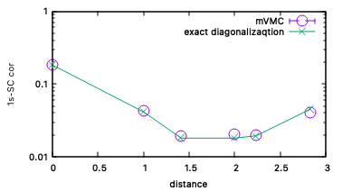

引力Hubbard模型における超伝導相関関数計算
^^^^^^^^^^^^^^^^^^^^^^^^^^^^^^^^^^^
mVMCは、任意の一体相関関数 :math:`c^{\dagger}_{i\sigma_i}c_{j\sigma_j}` および二体相関関数 :math:`c^{\dagger}_{i\sigma_i}c_{j\sigma_j} c^{\dagger}_{k\sigma_k}c_{l\sigma_l}` を測定できます。これらを組み合わせることで、これまでのチュートリアルで紹介してきたスピン構造因子などの物理量を求めることができます。
このチュートリアルでは、ホールドープされた正方格子上の引力Hubbard模型における超伝導相関関数を計算する方法を説明します。

Hubbard模型は次のように定義されます。

.. math::

 H = -t \sum_{\langle i,j\rangle, \sigma}c_{i\sigma}^{\dagger}c_{j\sigma} + U \sum_{i} n_{i\uparrow}n_{i\downarrow}.

これまでのチュートリアルでは、相互作用項 :math:`U` を斥力項として取り扱ってきましたが、今回は :math:`U=-4` として引力項として取り扱います。各相互作用項を変更したい場合は、 ``stan_opt.in`` 等を直接修正してください。

なお、このチュートリアルは、 `ISSPデータリポジトリ <https://isspns-gitlab.issp.u-tokyo.ac.jp/mvmc-dev/mvmc-tutorial>`_ に登録されているチュートリアルがもとになっています。

これまでのチュートリアルと同様に、次のコマンドを実行すると本チュートリアルの内容が全て実行されます。::

  sh run.sh

実行スクリプトの中身は以下の通りです。

波動関数の最適化
"""""""""""""""""""""""""""""""""""""""""
まず、乱数ペアリングの状態を初期状態として最適化を行います。
今回のチュートリアルでは、 ``MakeInput.py`` を用いず、 ``tutorial_2.2`` ディレクトリにある ``stan_opt.in`` を使用します。スクリプトでは、次のコマンドを実行しています。::

  ${VMCDRY} ./stan_opt.in
  ${MPI} ${VMC} namelist.def 
  cp ./output/zqp_opt.dat . 
  mv output opt

ここで ``${VMCDRY}`` は ``vmcdry.out`` 、 ``${VMC}`` は ``vmc.out`` へのパスを指定しています。 また、 ``${MPI}`` は MPI実行コマンドを指します。
最適化が終わりましたら、 ``opt/zvo_out_001.dat`` をプロットしてみて、波動関数の最適化が収束していることを確認してください。

相関関数の測定
"""""""""""""""""""""""""""""""""""""""""
続いて、最適化した波動関数を用いて相関関数を測定します。mVMCのスタンダードモードで生成される相関関数は、並進対照な波動関数に対して用いられるスピン構造因子と電荷構造因子が計算できるように設定されております。そのため、1sの超伝導相関関数を計算するためには、自分で相関関数を定義する必要があります。このチュートリアルでは、1sの超伝導相関関数を計算するために、 ``SCGreen.py`` というスクリプトを用意しています。このスクリプトを実行すると、 ``OneBodyG`` と ``TwoBodyG`` に対応する相関関数の定義ファイル ``green1`` と ``SC_1swave`` が生成されます。これらの定義ファイルを用いてmVMCの物理量測定を行います。測定が終わったら、出力ディレクトリを ``aft`` という名前に変更します。これらの一連の操作は、ジョブスクリプト ``run.sh`` 内の次のコマンドに対応しています。::

  python3 SCGreen.py input.toml
  ${VMCDRY}     ./stan_aft.in
  cp green1     greenone.def 
  cp SC_1swave  greentwo.def
  ${MPI} ${VMC} namelist.def ./zqp_opt.dat
  mv output aft 

超伝導相関関数の計算
"""""""""""""""""""""""""""""""""""""""""
最後に、測定した相関関数を用いて1s超伝導相関関数を計算します。1s超伝導相関関数は次のように定義されます。

  .. math::
    :label: sc_cor

    P(\boldsymbol{r}) = \frac{1}{N_s} \sum_{\boldsymbol{r}'} \langle \Delta^{\dagger} (\boldsymbol{r}') \Delta (\boldsymbol{r}'+\boldsymbol{r}) + \Delta (\boldsymbol{r}') \Delta^{\dagger} (\boldsymbol{r}'+\boldsymbol{r}) \rangle,

  .. math::

    \Delta (\boldsymbol{r}) = \frac{1}{\sqrt{2}} \left(  c_{\boldsymbol{r}\uparrow}c_{\boldsymbol{r}\downarrow} - c_{\boldsymbol{r}\downarrow} c_{\boldsymbol{r}\uparrow}  \right),

  .. math::

    \Delta^{\dagger} (\boldsymbol{r}) = \frac{1}{\sqrt{2}} \left(  c^{\dagger}_{\boldsymbol{r}\downarrow}c^{\dagger}_{\boldsymbol{r}\uparrow} - c^{\dagger}_{\boldsymbol{r}\uparrow} c^{\dagger}_{\boldsymbol{r}\downarrow}  \right).

式 :eq:`sc_cor` を計算するために、このチュートリアルでは ``CalcSC.py`` というスクリプトを用意しています。 ``CalcSC.py`` を実行すると、距離 :math:`|\boldsymbol{r}|` に依存した1s超伝導相関関数の最大絶対値が ``Result_1swave.dat`` というファイルに出力されます。ジョブスクリプトでは、エネルギー等の計算と合わせて、次のコマンドで実行されます。::

  python3 VMClocal.py  input.toml
  python3 CalcSC.py    input.toml

``gnuplot plot`` を実行することで、 厳密対角化の結果とともに ``Result_1swave.dat`` をプロットすることができます。
計算が正常終了していると、次のような図が出力されます。

紫丸がmVMCの結果を、緑線が厳密対角化の結果を表しています。mVMCの結果は厳密対角化での振る舞いを再現していることがわかります。

演習
-----------------------
- 引力相互作用を斥力にした場合、1sの超伝導相関関数がどのように変化するかを調べてください。
- 1s超伝導相関関数の :math:`U` 依存性を調べてください。
