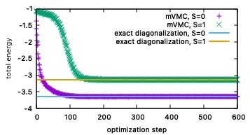
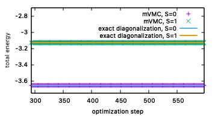
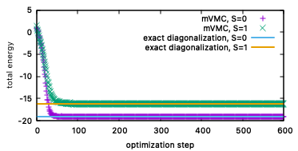
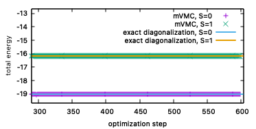

量子数射影を用いたスピンギャップ計算
^^^^^^^^^^^^^^^^^^^^^^^^^^^^^^^^^^^
量子数射影を用いることで、最適化する波動関数に対して特定の量子数を持たせることができます。このチュートリアルでは、一次元Heisenberg模型と一次元近藤格子模型を対象に、量子数射影をを用いてスピンギャップ :math:`\Delta_{\rm S}` を計算する方法を説明します。

スピンギャップ :math:`\Delta_{\rm S}=0` は、 :math:`S_{\rm tot}=0` 空間での最低エネルギーと :math:`S_{\rm tot}=1` 空間での最低エネルギーの差として定義されます。すなわち

.. math::

  \Delta_{\rm S} = E_{S_{\rm tot}=1} - E_{S_{\rm tot}=0}.

を計算する必要があります。ここで、 :math:`E_{S_{\rm tot}=1}` と :math:`E_{S_{\rm tot}=0}` はそれぞれ、 :math:`S_{\rm tot}=1` での全エネルギー と :math:`S_{\rm tot}=0` での全エネルギーです。これらの全エネルギーは、mVMCで実装されているスピン量子数射影を用いれば計算することができます。

一次元Heisenberg模型
"""""""""""""""""""""""""""""""""""""""""
まず、システムサイズ :math:`L=8` での一次元Heisenberg模型におけるスピンギャプを計算します。一次元Heisenberg模型は次式で定義されます。

.. math::

 H = J \sum_{\langle i,j\rangle}\boldsymbol{S}_{i} \cdot \boldsymbol{S}_{j},\ \boldsymbol{S}_{i} = \frac{1}{2} \sum_{\alpha,\beta} c_{i\alpha}^{\dagger} \boldsymbol{\sigma}_{\alpha\beta} c_{i\beta}.

ここで、 :math:`\boldsymbol{\sigma}` はパウリ行列です。 :math:`S=1/2` の場合には、この模型の基底状態は  :math:`\Delta_{\rm S}=0` であることが知られています。

次のコマンドを実行してください。::

  sh run.sh spin

コマンドを実行すると、 ``spin`` ディレクトリが作成され、その中に :math:`S_{\rm tot}=0` での最適化結果 ``output_s0`` と :math:`S_{\rm tot}=1` での最適化結果 ``output_s1`` が保存されています。

最適化の結果を可視化するために、次のコマンドを実行してください。::

  gnuplot plot_spin

すると、次のような図が得られます。

紫点と緑点が、それぞれ :math:`S_{\rm tot}=0` 空間での最適化結果と :math:`S_{\rm tot}=1` 空間でのmVMCによる最適化結果です。水色線とオレンジ線は、厳密対角化によって得られたそれぞれの空間における最低エネルギーを示しています。
次の図のように、最後の最適化付近を拡大してみると、mVMCは厳密対角化によって得られた結果とよく一致していることがわかります。このように、mVMCでは、量子数射影を用いることで、それぞれの空間における最低エネルギーを求めることができます。

この結果から、スピンギャップ  :math:`\Delta_{\rm S}` を計算することができます。本来は最適化した波動関数を用いて物理量測定を行い、エネルギー期待値を求めるべきですが、ここでは最適化結果のエネルギーを直接用いて値を見積もります。
最適化が正常終了すると、 ``output`` ディレクトリに ``zqp_opt.dat`` というファイルが出力されます。このファイルには、最後の最適化ステップから ``NSROptItrSmp`` 分の区間における最適化された波動関数のパラメータの平均値だけでなく、同区間におけるエネルギー値などといった物理量の平均値も出力されています。エネルギー(の実部)は、 ``zqp_opt.dat`` ファイルの初めに記載されています。

``spin/output_s0`` と ``spin/output_s1`` ディレクトリにある ``zqp_opt.dat`` ファイルからエネルギー値を習得した結果は ``spin/spin_gap.dat`` に出力されています。 ``spin_gap.dat`` の中身は次のようになっています。 ::

  #E0_from_zqp_opt.dat   E1_from_zqp_opt.dat   Delta_s=E1-E0
  -3.65109 -3.12842 .52267

ここで、最後の列がスピンギャップ  :math:`\Delta_{\rm S}` の値となっています。

演習
-----------------------
- 物理量測定を行い、エネルギー期待値と誤差を求め、スピンギャップ値を計算してください。
- システムサイズ :math:`L` を大きくしていき、スピンギャップ  :math:`\Delta_{\rm S}` のシステムサイズ依存性を確認してください。

一次元近藤格子模型
"""""""""""""""""""""""""""""""""""""""""
同じ計算をシステムサイズ :math:`L=4` でのハーフフィリングにおける一次元近藤格子模型に対して行います。近藤格子模型は、伝導層と局在スピン層が交換相互作用で結合している模型です。そのため、ユニットセルあたり2自由度あることになります。一次元近藤格子模型は次式で定義されます。

.. math::
  
  H = -t \sum_{\langle i, j \rangle , \sigma} c^{\dagger}_{i\sigma {\rm c}} c_{j\sigma {\rm c}} + J \sum_{i}\boldsymbol{S}_{i {\rm c}} \cdot \boldsymbol{S}_{i {\rm s}}.

ここで、 :math:`c^{\dagger}_{i\sigma {\rm c}}/c_{i\sigma {\rm c}}` は伝導層の生成/消滅演算子、 :math:`\boldsymbol{S}_{i {\rm c}}` は伝導層のスピン演算子、 :math:`\boldsymbol{S}_{i {\rm s}}` は局在スピン層のスピン演算子です。 :math:`S=1/2` の場合には、この模型の基底状態は  :math:`\Delta_{\rm S} \neq 0` であることが知られています。(詳細は参考文献2を参照してください。)

次のコマンドを実行した後、Heisenberg模型でのチュートリアル同様、最適化過程をプロットしてみてください。::

  sh run.sh kondo
  gnuplot plot_kondo

すると、次のような図が得られます。

凡例はHeisenberg模型の場合と同じです。一次元近藤格子模型の場合においても、mVMCの最適化結果は厳密対角化によって得られた結果に収束していっていることがわかります。なお、最適化から得られたエネルギーをもとに計算したスピンギャップ :math:`\Delta_{\rm S}` の値は、 ``kondo/spin_gap.dat`` に出力されています。

演習
-----------------------
- 物理量測定を行い、エネルギー期待値と誤差を求め、スピンギャップ値を計算してください。
- システムサイズ :math:`L` を大きくしていき、スピンギャップ  :math:`\Delta_{\rm S}` のシステムサイズ依存性を確認してください。

参考文献
""""""""""""""""""""""
#. `ISSPデータリポジトリ <https://isspns-gitlab.issp.u-tokyo.ac.jp/mvmc-dev/mvmc-tutorial>`_ 
#.  \H. Tsunetsugu, M. Sigrist, and K. Ueda, `Rev. Mod. Phys. 69, 809 (1997) <https://journals.aps.org/rmp/abstract/10.1103/RevModPhys.69.809>`_