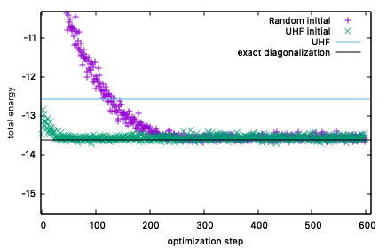

二次元Hubbard模型
^^^^^^^^^^^^^^^^^^^^^^^^^^^^^^^^^^^
このチュートリアルでは、次の式で定義されるハーフフィリングにおける正方格子上の拡張Hubbard模型の基底状態を乱数ペアリングと平均場近似を元に構築した状態、それぞれを初期状態にして計算します。

.. math::

 H = -t \sum_{\langle i,j\rangle, \sigma}c_{i\sigma}^{\dagger}c_{j\sigma} + U \sum_{i} n_{i\uparrow}n_{i\downarrow} + V \sum_{i<j} n_{i}n_{j},\ n_i = n_{i\uparrow} + n_{i\downarrow}

ハミルトニアンの係数は :math:`t=1` 、 :math:`U=4` 、 :math:`V=0` としています。変更したい場合は、 ``MakeInput.py`` を直接修正してください。

なお、このチュートリアルは、 `ISSPデータリポジトリ <https://isspns-gitlab.issp.u-tokyo.ac.jp/mvmc-dev/mvmc-tutorial>`_ に登録されているチュートリアルを元にしています。

乱数初期状態での最適化
"""""""""""""""""""""""""""""""""""""""""
まず、乱数ペアリングの状態を初期状態として最適化を行います。mVMCの場合、初期状態を指定しないと自動的に乱数ペアリング状態が初期状態として用いられます。次のコマンドを実行してください。::

  sh run.sh

このコマンドを実行すると、tutorial_1.2 一次元Hubbard模型で説明した内容が全て実行されます。

演習
-----------------------
- 得られた ``SqNq.dat`` を使って、スピン構造因子 :math:`S(\boldsymbol{q})` をプロットし、 :math:`\boldsymbol{q}=(\pi, \pi)` にピークを持つことを確認してください。
- ``MakeInput.py`` を修正して、相互作用パラメータ :math:`U` と :math:`V` の値を変えた場合、スピン構造因子がどのように変化するのかを調べてみてください。

UHF初期状態での最適化
"""""""""""""""""""""""""""""""
次に、UHF (Unrestricted Hartree-Fock) 近似で得られた :math:`\prod_n (\sum_{i\sigma} \Phi_{in\sigma} c^{\dagger}_{i\sigma}) |0\rangle` からペアリング関数 :math:`(\sum_{i,j} f_{ij} c^{\dagger}_{i\uparrow} c^{\dagger}_{j\downarrow})^{N} |0\rangle` を構築し、それをmVMCの初期状態として最適化を行ってみます。詳細は論文等で紹介されているので割愛しますが、次の関係式から構築することができます。

 .. math::
  
    f_{ij} = \sum_{n} \Phi_{in\uparrow} \Phi_{jn\downarrow}

ここで、 :math:`\Phi_{in\sigma}` はUHF近似で得られた一電子軌道を、 :math:`n` はUHF近似の固有状態のインデックスを表しています。mVMCパッケージに含まれているUHFコードを使用することで、上述の式に基づいて ``InOrbital`` の形式に合わせた :math:`f_{ij}` を出力してくれます。

``sh run.sh`` を実行した後で、次のコマンドを実行してください。::

  sh run_uhf.sh

``run_uhf.sh`` は ``run.sh`` とほとんど同じです。主な違いは15、16行目の::

  ${UHF}  namelist.def
  echo " InOrbital zqp_APOrbital_opt.dat " >> namelist.def

です。一行目ではUHFコードを実行し、二行目ではUHFコードで構築された :math:`f_{ij}` が出力されたファイル ``zqp_APOrbital_opt.dat`` をmVMCの入力ファイル ``namelist.def`` に追記しています。

正常に実行された場合、 ``gnuplot plot`` を実行すると、次のようなグラフが得られます。

下図は、上図を拡大したものになっています。
紫点が乱数ペアリングを初期状態にした結果、緑点がUHF近似から構築した状態を初期状態にした結果です。水色線と黒線は、それぞれ、UHFで得られたエネルギーと厳密対角化で得られるエネルギーです。UHF近似による初期状態を使ったほうが、初期ステップでのエネルギー値が低く、少ない最適化ステップ数で収束していることがわかります。